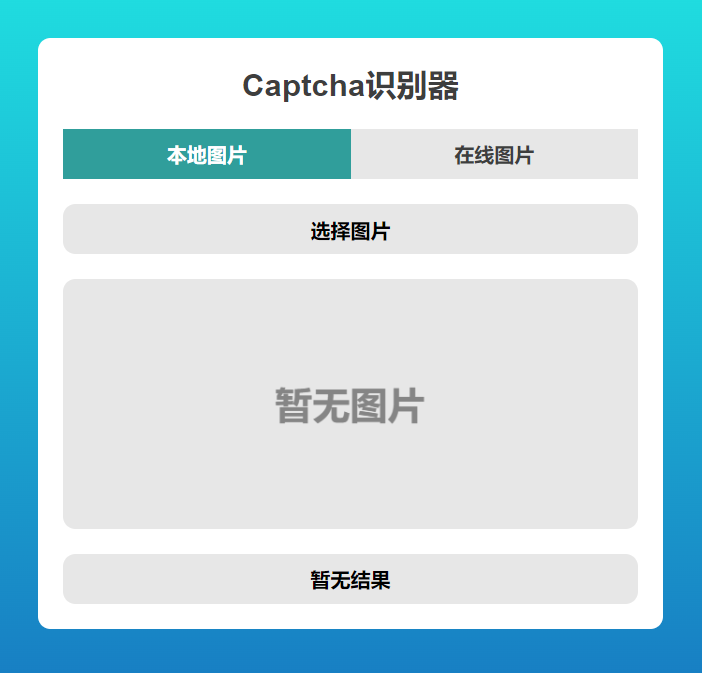
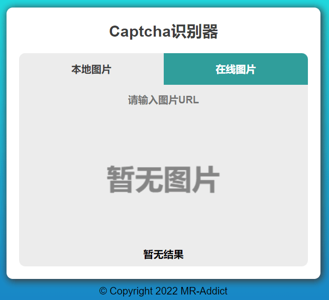

<h1>
  Captcha识别器
  
</h1>

## 1. 如何搭建

### 1.1 使用Docker

克隆文档：

```bash
git clone https://github.com/MR-Addict/captcha.git
```

启动docker镜像：

```bash
docker-compose up -d
```

### 1.2 本地部署

克隆文档：

```bash
git clone https://github.com/MR-Addict/captcha.git
```

安装npm依赖：

```bash
npm install
```

安装python依赖：

```bash
python install -r requirements
```

启动app：

```bash
node index.js
```

## 2. 如何使用

### 2.1 使用API接口

服务器请自行部署，API接口用法如下：

|  参数   |      值      |
| :-----: | :----------: |
| method  |     post     |
|  type   | local/online |
| captcha | 本地图片/URL |

#### 2.1.1 curl

```bash
# 上传本地图片
curl -skL http://localhost:8000 -F type=local -F captcha=@3913.jpg | sed -E 's/.*"message":"?([^,"]*)"?.*/\1/'
# 上传云端图片
curl -skL http://localhost:8000 -F type=online -F captcha="http://online/image/url" | sed -E 's/.*"message":"?([^,"]*)"?.*/\1/'
```

#### 2.1.2 python

```python
import json
import requests


# 上传本地图片
def decode_captcha_local(img_path):
    data = {"type": "local"}
    files = {'captcha': open(img_path, 'rb')}
    response = requests.post("http://localhost:8000", data=data, files=files)
    result = json.loads(response.text)


# 上传在线图片
def decode_captcha_online(img_url):
    data = {"type": "online", "captcha": img_url}
    response = requests.post("http://localhost:8000", data=data)
    result = json.loads(response.text)


if __name__ == '__main__':
    print(decode_captcha_local("images/captcha.jpg")["message"])
    print(decode_captcha_online("http://online/image/url")["message"])
```

> 备注：其他语言和脚本使用方法类似

### 2.2 使用Web UI

部署好服务器后，你可以直接打开其本地Web地址

- [http://localhost:8000](http://localhost:8000)

本地图片模式



在线图片模式



## 3. 说明

本项目核心Captcha识别使用了ddddocr的Python库，详细内容可参考sml2h3的[GitHub项目](https://github.com/sml2h3/ddddocr)。
