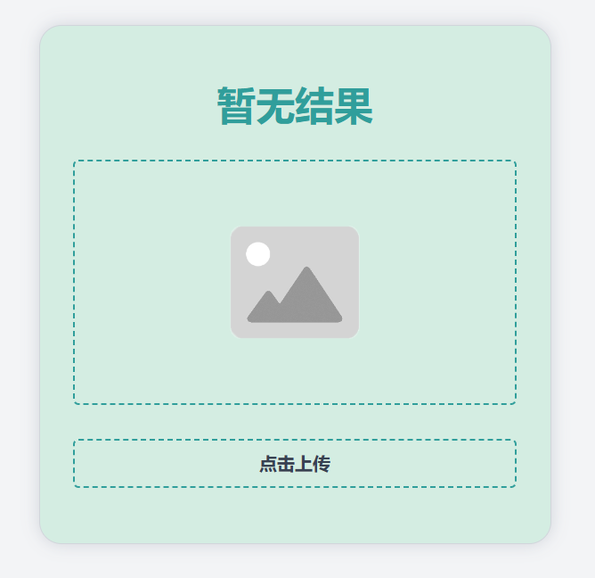

<h1>
  Captcha识别器
  
</h1>

## 1. 如何搭建

### 1.1 使用Docker

#### 1.1.1 一键部署

一键部署

```bash
docker run --restart=unless-stopped -p 8000:8000 -d --name captcha mraddict063/captcha
```

#### 1.1.2 手动编译

克隆文档

```bash
git clone https://github.com/MR-Addict/captcha.git
```

编译镜像

```bash
docker build -t captcha .
```

启动镜像

```bash
docker run --restart=always -p 8000:8000 -d --name captcha captcha
```

> docker-compose版
> ```bash
> docker-compose up -d
> ```

### 1.2 本地部署

克隆文档

```bash
git clone https://github.com/MR-Addict/captcha.git
```

安装python依赖

```bash
python install -r requirements
```

启动app

```bash
python index.py
```

## 2. 如何使用

### 2.1 使用API接口

服务器请自行部署，API接口用法如下：

|  参数   |    值    |
| :-----: | :------: |
| method  |   post   |
| captcha | 本地图片 |

#### 2.1.1 curl

```bash
curl -skL http://localhost:8000 -F type=local -F captcha=@captcha.jpg
```

#### 2.1.2 python

```python
import json


def decode_captcha(img_path):
    files = {'captcha': open(img_path, 'rb')}
    response = requests.post("http://localhost:8000", files=files)
    result = json.loads(response.text)


if __name__ == '__main__':
    print(decode_captcha("images/captcha.jpg"))
```

> 备注：其他语言和脚本使用方法类似

### 2.2 使用Web UI

部署好服务器后，你可以直接打开其本地Web地址

- [http://localhost:8000](http://localhost:8000)



## 3. 说明

本项目核心Captcha识别使用了ddddocr的Python库，详细内容可参考sml2h3的[GitHub项目](https://github.com/sml2h3/ddddocr)。

另外本项目也使用了sml2h3的[ddddocr训练项目](https://github.com/sml2h3/dddd_trainer)，来训练适合南京工业大学的校园网登录图形验证码。

我使用自己训练的模型，1000张样本的成功率是100%。你也可以使用默认的模型，识别的成功率也很高，1000张样本只有5张错误。

如果你想使用默认的模型，可以修改`index.py`中的以下内容：

```python
# 默认模型
# ocr = ddddocr.DdddOcr(beta=False, show_ad=False)
# 我自己训练的模型
ocr = ddddocr.DdddOcr(beta=False, show_ad=False, import_onnx_path="models/captcha.onnx", charsets_path="models/charsets.json")
```

目前南京工业大学的校园网登录图形验证码如下。


